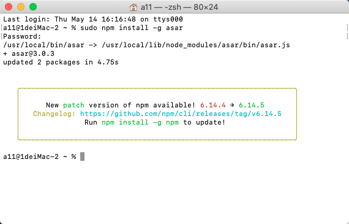
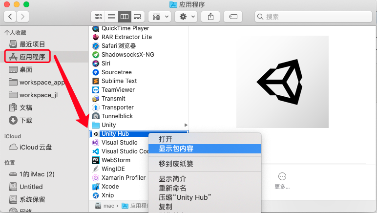
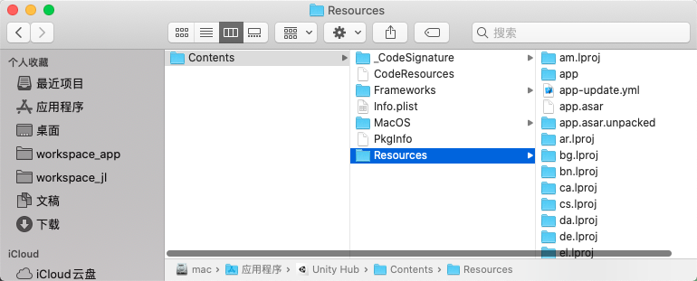
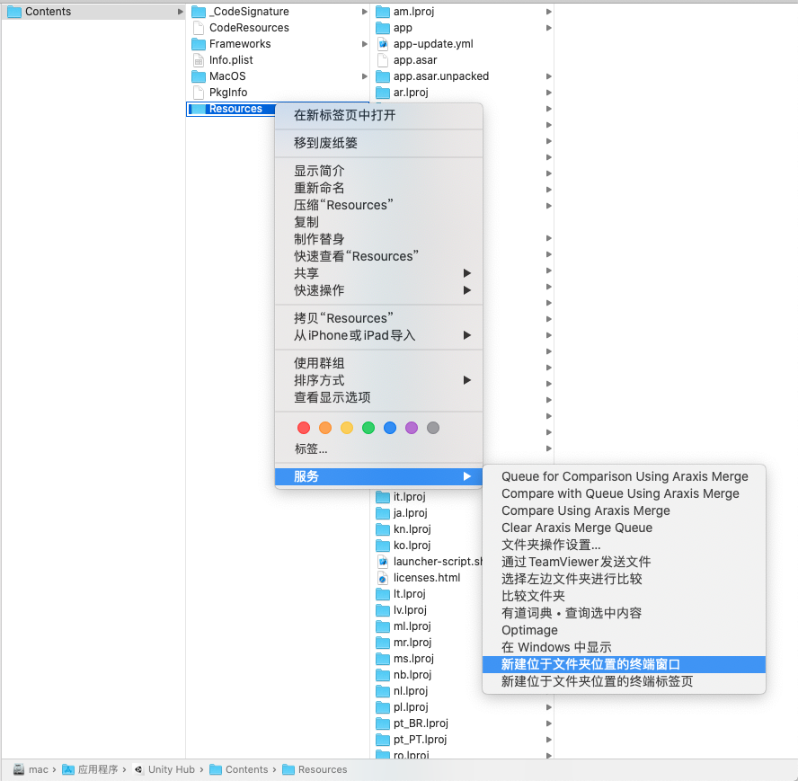
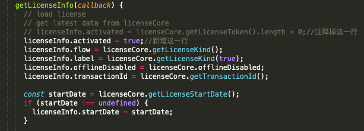
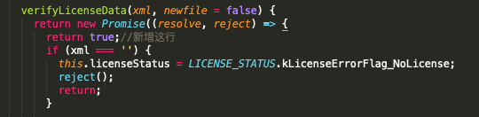
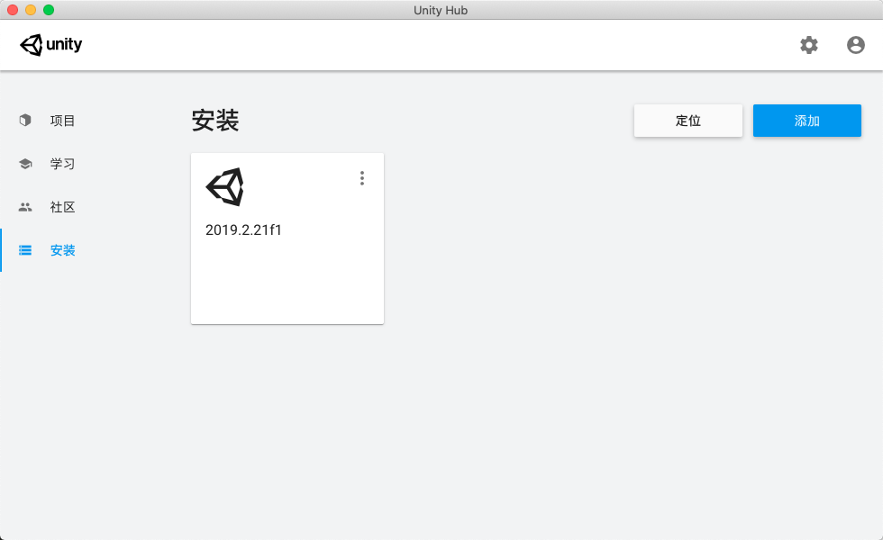

# Unity Hub for Mac 破解方法

1. 安装node.js
自行选择下载安装包或者使用命令行进行安装。
https://www.runoob.com/nodejs/nodejs-install-setup.html

2. 打开终端命令
2.1 打开mac的终端，然后输入以下命令
>sudo npm install -g asar

2.2 打开访达，在应用程序中找到Unity Hub，然后打开显示包内容，然后依次进入Contents ——> Resources，参照下图。

2.3 在Resources文件夹上打开新建位于文件夹位置的终端窗口

2.4 接着在打开的终端命令窗口上，输入
>asar extract app.asar app

2.5 修改Resources文件下的 app/src/services/licenseService/licenseClient.js 路径下js脚本

2.6 修改Resources文件下的 app/src/services/licenseService/licenseCore.js 路径下js脚本

3. 大功告成
